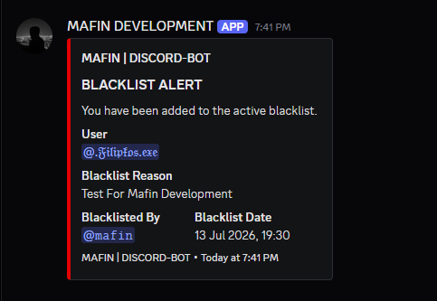
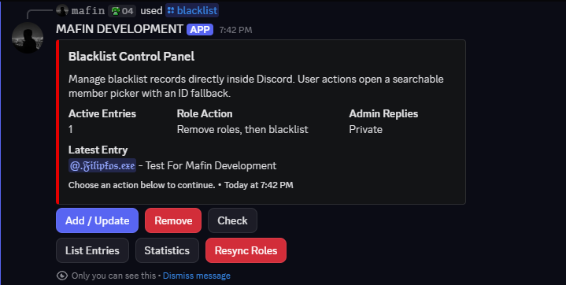

# Discord Blacklist Bot

Secure, Discord-only blacklist bot. There is no website, web server, browser dashboard, REST API, or HTML preview.

GitHub description:

```text
Secure Discord-only blacklist bot with slash commands, searchable admin panel, role cleanup, JSON storage, and log embeds.
```

## Preview

Blacklist log embed:



Admin control panel:



## Features

- Automatically registers `/blacklist` when the bot starts.
- Admin-only Discord control panel with add/update, remove, check, list, statistics, and role resync actions.
- Uses slash commands, buttons, searchable user select menus, modals, ephemeral replies, and log embeds.
- Restricts administration to configured users, configured roles, or members with Discord Administrator permission.
- Validates configured guild, roles, log channel, permissions, and role hierarchy.
- Stores blacklist records in `data/blacklist.json` with atomic writes.
- Removes existing manageable roles and assigns the blacklist role immediately and when blacklisted members rejoin.
- Optionally removes the blacklist role when a user is removed from the blacklist.
- Catches Discord API, role, log, and DM failures so they do not crash the bot.

## Paste Config

Create `.env` and paste this:

```env
DISCORD_TOKEN=PASTE_BOT_TOKEN_HERE
DISCORD_GUILD_ID=PASTE_SERVER_GUILD_ID_HERE
CONFIG_PATH=./config.json
```

Create `config.json` and paste this:

```json
{
  "discordToken": "",
  "discordGuildId": "PASTE_SERVER_GUILD_ID_HERE",
  "adminRoleIds": [
    "PASTE_ADMIN_ROLE_ID_HERE"
  ],
  "adminUserIds": [
    "PASTE_OWNER_USER_ID_HERE"
  ],
  "blacklistRoleId": "PASTE_BLACKLIST_ROLE_ID_HERE",
  "logChannelId": "PASTE_LOG_CHANNEL_ID_HERE",
  "dmBlacklistedUsers": false,
  "removeBlacklistRoleOnUnblacklist": true,
  "embed": {
    "title": "BLACKLIST ALERT",
    "color": "#e30000",
    "authorName": "MAFIN | DISCORD-BOT",
    "authorIconUrl": "",
    "thumbnailUrl": "",
    "imageUrl": "",
    "footerText": "MAFIN | DISCORD-BOT",
    "footerIconUrl": ""
  }
}
```

ID guide:

- `DISCORD_TOKEN`: bot token from Discord Developer Portal.
- `DISCORD_GUILD_ID`: your Discord server ID.
- `adminRoleIds`: role IDs allowed to use `/blacklist`.
- `adminUserIds`: user IDs allowed to use `/blacklist` even without an admin role.
- `blacklistRoleId`: role given to blacklisted users.
- `logChannelId`: channel where blacklist embeds are sent.

Keep `discordToken` empty in `config.json` if you use `.env`. That keeps the token out of normal config.

## Setup

1. Install Node.js 18.17 or newer.
2. Install dependencies:

   ```bash
   npm install
   ```

3. Fill `.env` and `config.json` using the paste blocks above.
4. In the Discord Developer Portal, enable **Server Members Intent**.
5. Invite the bot with scopes `bot` and `applications.commands`.
6. Give the bot these permissions:

   - Manage Roles
   - View Channels
   - Send Messages

7. Put the bot role above the blacklist role in Discord role settings.
8. Start the bot:

   ```bash
   npm start
   ```

The bot registers `/blacklist` on startup. There is no separate deploy command.

## Usage

Run:

```text
/blacklist
```

Then choose from the Discord control panel:

- `Add / Update User`: opens a searchable Discord user selector, then a reason modal. Use `Use User ID` for users outside the server.
- `Remove User`: opens a searchable Discord user selector. Use `Use User ID` for users outside the server.
- `Check User`: opens a searchable Discord user selector. Use `Use User ID` for users outside the server.
- `List Entries`: shows the latest 10 entries.
- `View Statistics`: shows totals and role status.
- `Resync Roles`: removes existing manageable roles from blacklisted members, reapplies missing blacklist roles, and removes stale blacklist roles if cleanup is enabled.

When a member is blacklisted, the bot removes every role it can manage before adding the blacklist role. Discord does not allow bots to remove managed integration roles or roles higher than the bot's highest role.

Never paste your bot token into Discord chat, screenshots, or public repositories. If a token is exposed, rotate it in the Discord Developer Portal.
